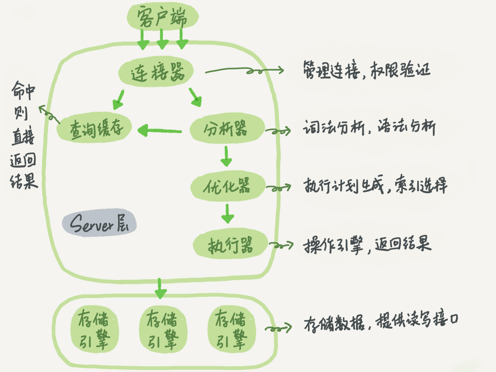

# 基本架构

参考MYSQL的结构, 如下图, 不同的是本项目没有实现查询缓存

> 不使用查询缓存的原因: 查询缓存并不是一个好的设计
> 
> > 参考文献: [一条SQL查询语句是如何执行的？](https://time.geekbang.org/column/article/68319)
> 
> "大多数情况下我会建议你不要使用查询缓存，为什么呢？因为查询缓存往往弊大于利。查询缓存的失效非常频繁，只要有对一个表的更新，这个表上所有的查询缓存都会被清空。因此很可能你费劲地把结果存起来，还没使用呢，就被一个更新全清空了。对于更新压力大的数据库来说，查询缓存的命中率会非常低。除非你的业务就是有一张静态表，很长时间才会更新一次。比如，一个系统配置表，那这张表上的查询才适合使用查询缓存。
>
> 需要注意的是，MySQL 8.0 版本直接将查询缓存的整块功能删掉了，也就是说 8.0 开始彻底没有这个功能了。"

# 目录结构